# RELAY

**Worlds end. Your stories don't.**

[](https://github.com/Phronesis618/HackMIT2026/actions/workflows/ci.yml)
[](https://relay-a3yv.onrender.com)
[](https://phronesis618.github.io/HackMIT2026/)

RELAY is a browser co-op sci-fi action roguelike for **HackMIT 2026 (Entertainment track)**.
Your crew types one sentence each. Claude turns those sentences into a world — its name, its
rooms, its monsters, the rules physics obeys inside it, and the notes the dead left behind — and
you fight through that world together and plant an Anchor before it collapses. What you did
there comes home with you: a receipt saying whose idea became what, an arrival photo, a kill
count, the lore you found.

**The model writes data, never code.** Every world arrives as JSON, is validated against a Zod
schema and a closed registry of IDs, and is compiled by code we wrote into rooms the engine can
draw. No generated HTML, JS, SVG, URLs or expressions ever reach a player.

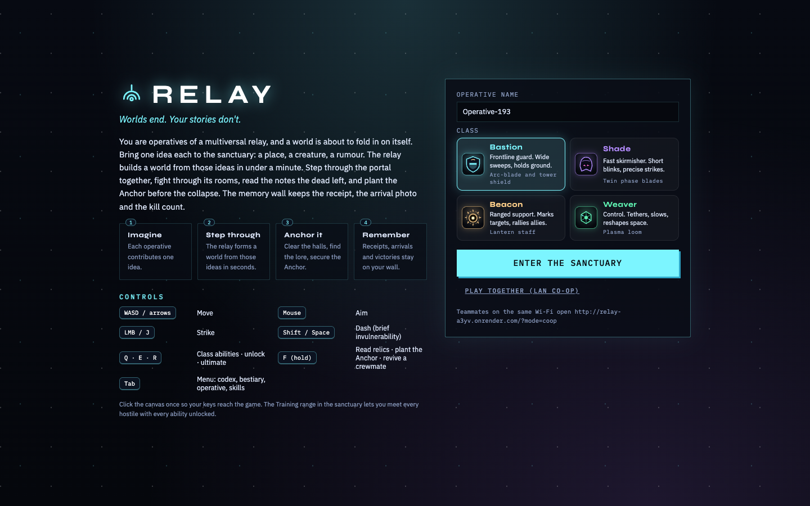

---

## Play it

| How | Where | What you get |
| --- | --- | --- |
| **Hosted, full game** | **<https://relay-a3yv.onrender.com>** | Live Claude generation and LAN/remote co-op (`/?mode=coop`). Free Render instance: it sleeps after 15 min, so the first load can take ~1 minute. |
| Hosted, no backend | <https://phronesis618.github.io/HackMIT2026/> | Solo play on a bundled world, labelled **OFFLINE FIXTURE (client preview)**. No AI call, no co-op. |
| Local | `npm ci && npm run dev` → <http://localhost:5173> | Everything, with or without an API key. |

```bash
git clone https://github.com/Phronesis618/HackMIT2026.git relay && cd relay
npm ci                # Node >= 20.19 (developed on 26.7; .nvmrc says 26)
cp .env.example .env  # the five-biome dungeon + world laws; omit it for three-room worlds
npm run dev           # API/WS server on :8787 + Vite client on :5173
```

You spawn in headquarters with no key and no configuration: worlds come from the offline
composer or a labelled fixture. To have **Claude** write them, put a key in `.env`
(see [Configuration](#configuration)) and restart.

**Controls:** **WASD/arrows** move · **mouse** aims · **J / left click** strikes · **Shift/Space**
dashes (brief invulnerability) · **Q · E · R** are your class ability, your unlock and your
ultimate · **hold F** reads a relic, plants the Anchor or revives a crewmate · **Tab** opens the
menu (codex, bestiary, operative, skills) · **hold M** shows the floor map.

---

## A run, in pictures

**1 — The Stillpoint.** A walkable sanctuary, not a menu. Weapon stands to the northwest, the
records archive northeast, a training range southwest, the contribution console southeast, and
the departure gate south. The memory wall starts empty and says so: *"Nothing yet. Memories are
saved from real play."*

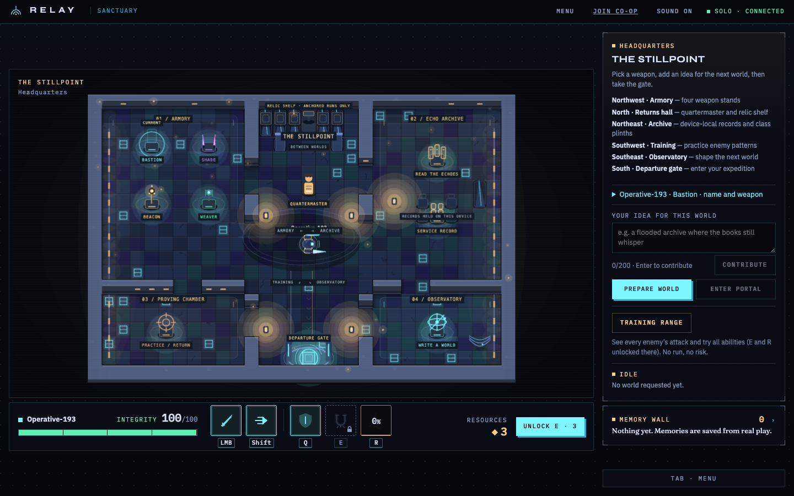

**2 — Pick what you fight with.** Walk to a stand, press F. Each of the four classes has a
basic attack, a Q ability, an E unlock bought with what a run pays out, and an R ultimate that
charges in combat — with their real numbers on the panel, not percentages.

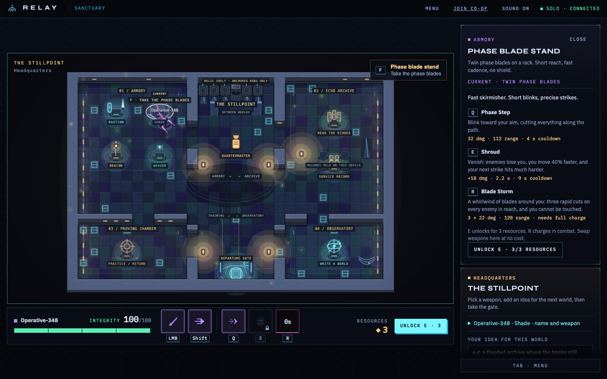

**3 — Everyone brings one idea.** A place, a creature, a rumour. The ideas orbit the forming
ring with their authors' names on them while the relay writes the world.

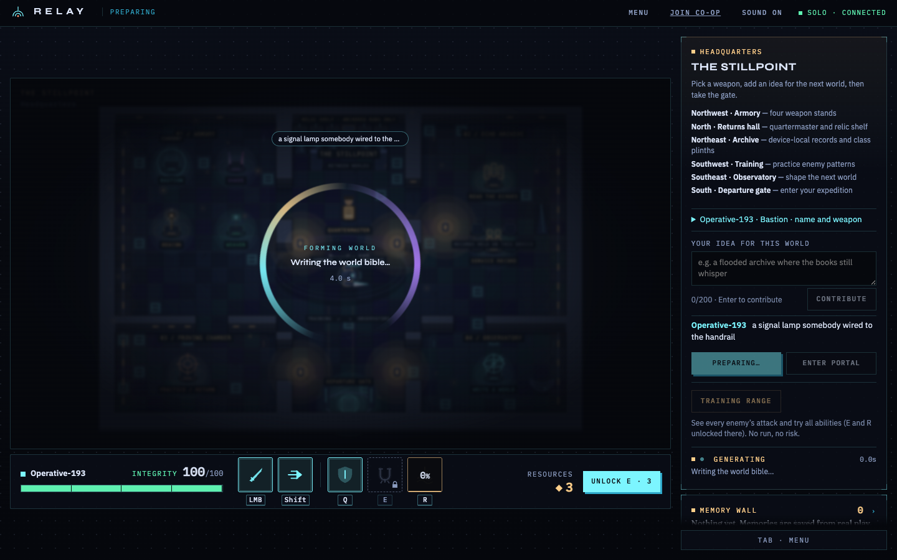

**4 — The receipt, before you go anywhere.** The world Claude wrote from *"a signal lamp
somebody wired to the handrail"*: **Gravel Bar Relay Station**, *"2,800 flashes filed. Eleven
keepers on the handrail when Holub threw the switch."* Three rooms, eleven lore fragments to
find, and three **laws** the world imposes on play, each with the numbers it will actually
enforce. The badge reads `LIVE · CLAUDE-SONNET-4-6`; it cannot say that unless a live model
call really produced this world.

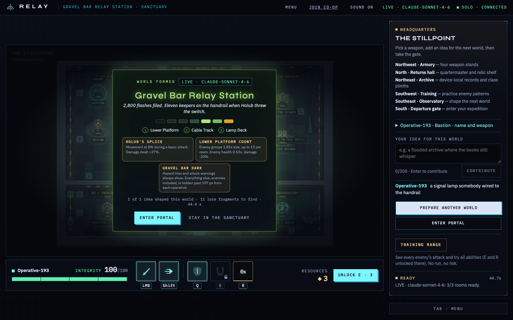

**5 — Step through.** The world's own description sits over its first room; the laws ride along
the top of the HUD. This is the live world above, drawn by our renderer from validated data.

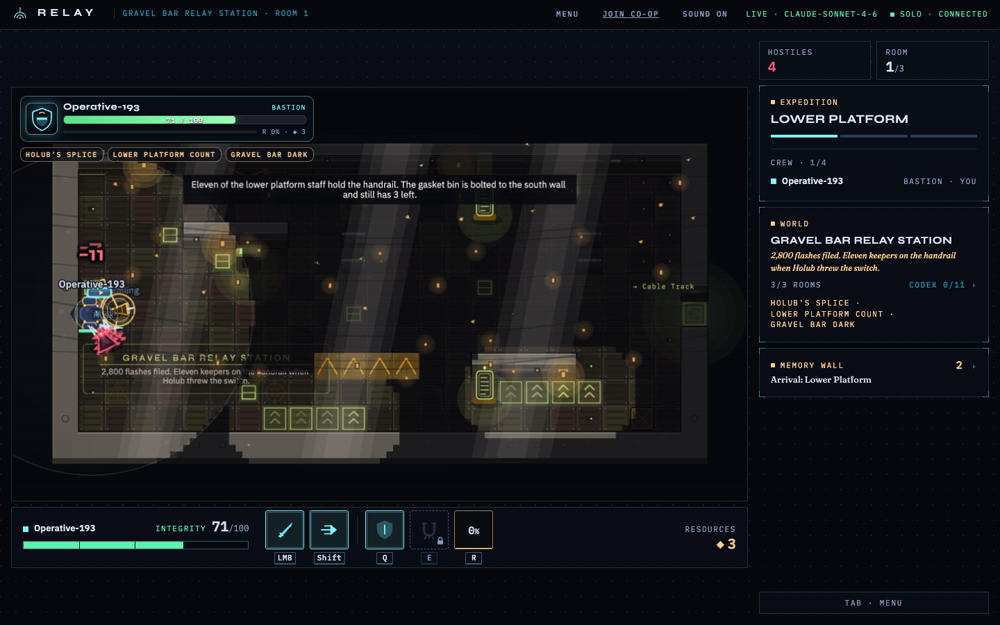

**6 — Fight it together.** Up to four operatives on one authoritative simulation: one host owns
combat, generation and room transitions, everyone else sends intents and draws snapshots.

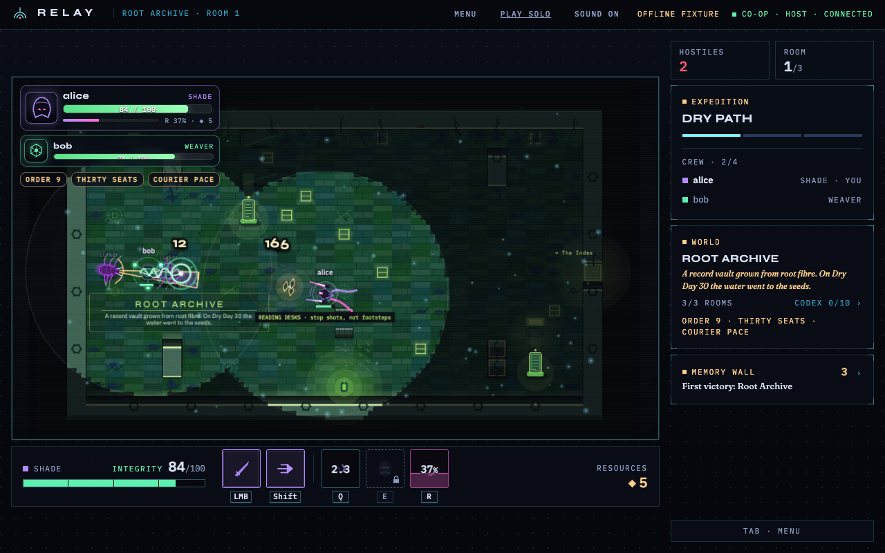

**7 — Lore is found, not narrated.** Nothing the model wrote is dumped in a sidebar. Fragments
are relics on the floor (hold F) or remains dropped the first time an enemy type dies, and only
what you actually picked up enters the codex.

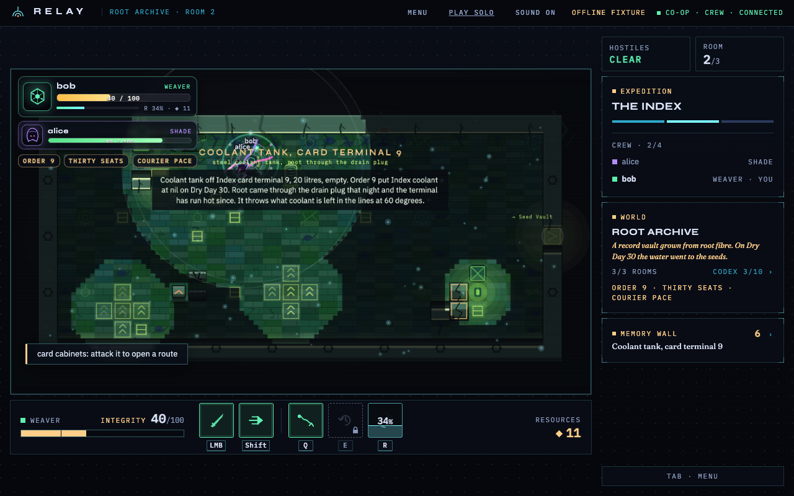

**8 — The world writes part of your skill tree.** The blue nodes are ours. The amber branch —
here *Board clears*, *Tag A-17*, *Trunk 4 parted*, *Two flashes* — is **attunements the world
itself wrote**, bought with what its rooms paid out.

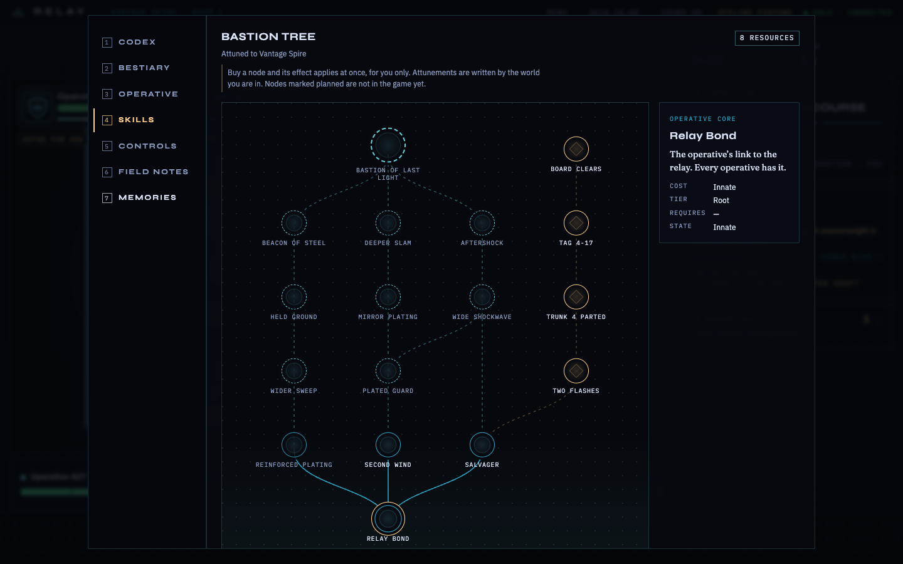

**9 — Go deep.** With the shipped defaults a world is five biomes of 10/15/20/25/30 rooms: doors seal
until a room is clear, a fog-of-war minimap fills in, and hold **M** opens the floor map —
elite packs, caches, rest sites, relics, the exit gate.

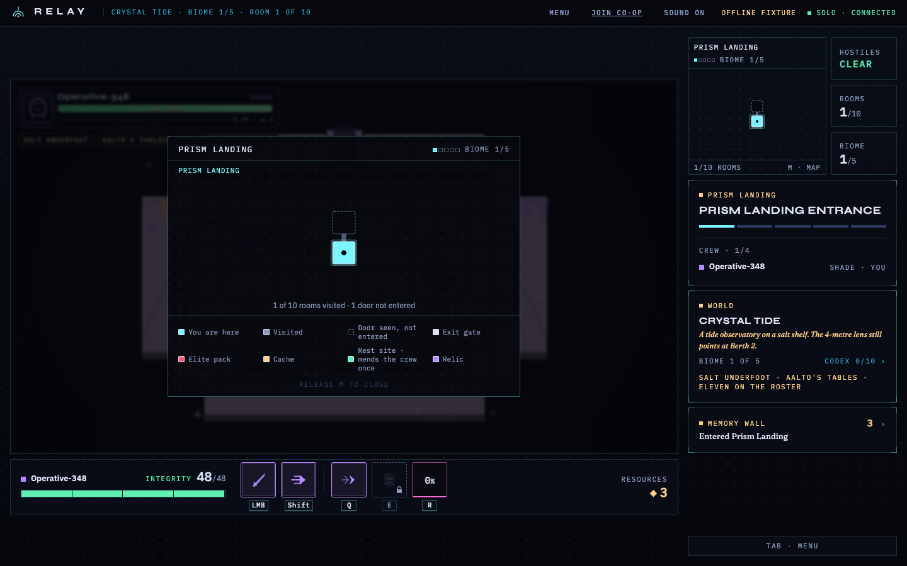

**10 — The Custodian.** At the end of the route stands a three-phase boss the world named and
gave its own phase titles and patterns to, in a sealed room, under that world's laws.

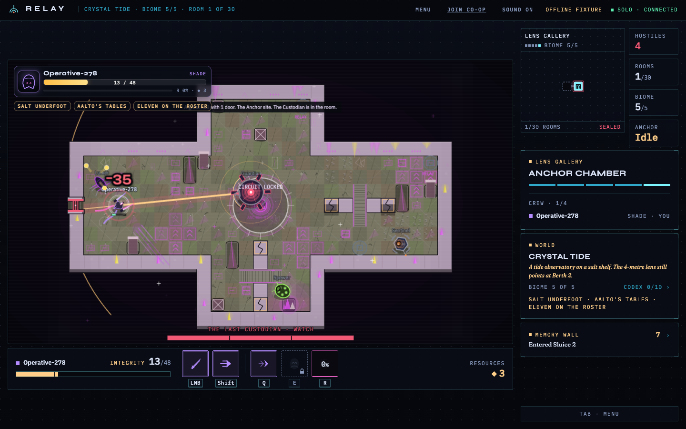

**11 — Plant the Anchor.** Three relays in order, then the core: tap F at each lit relay and
dash through the pulses the Anchor throws while it charges.

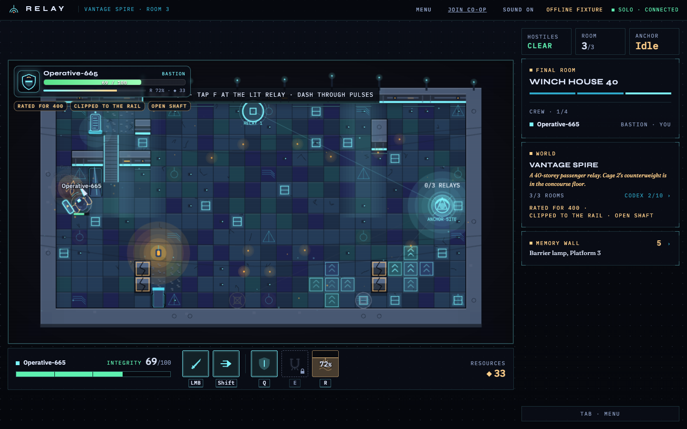

**12 — The debrief tells the truth about your run.** *"Operative-665 returned with the world
anchored"* — or watched it collapse, if that is what happened. Beneath it: the arrival keepsake,
and a line for each thing the run actually recorded (*"planted the Anchor in room 3"*). The card
in the middle of the screen is that same world, offering another run through it.

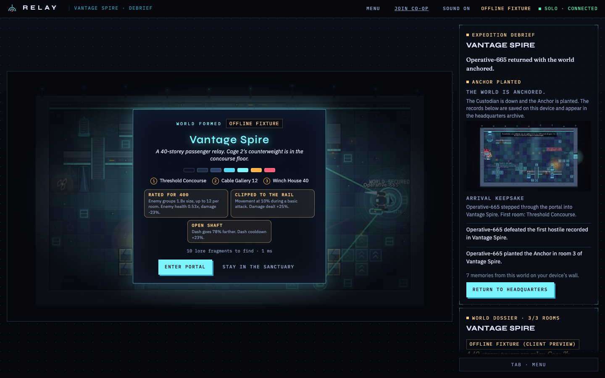

**13 — The memory wall keeps it.** Memories are derived only from real game events, saved in
this browser, and labelled with the provenance of the world they came from — including, here,
*"This world is an offline fixture. The ideas were recorded and did not shape it."*

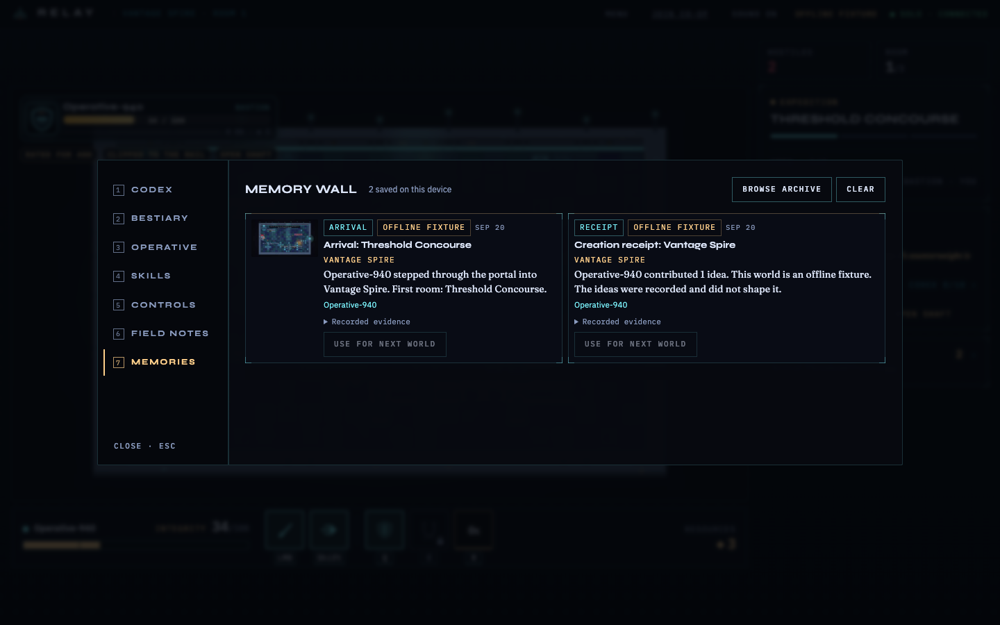

**14 — The codex only holds what you found.** Everything else reads `NOT FOUND YET`, with the
room or the enemy that holds it.

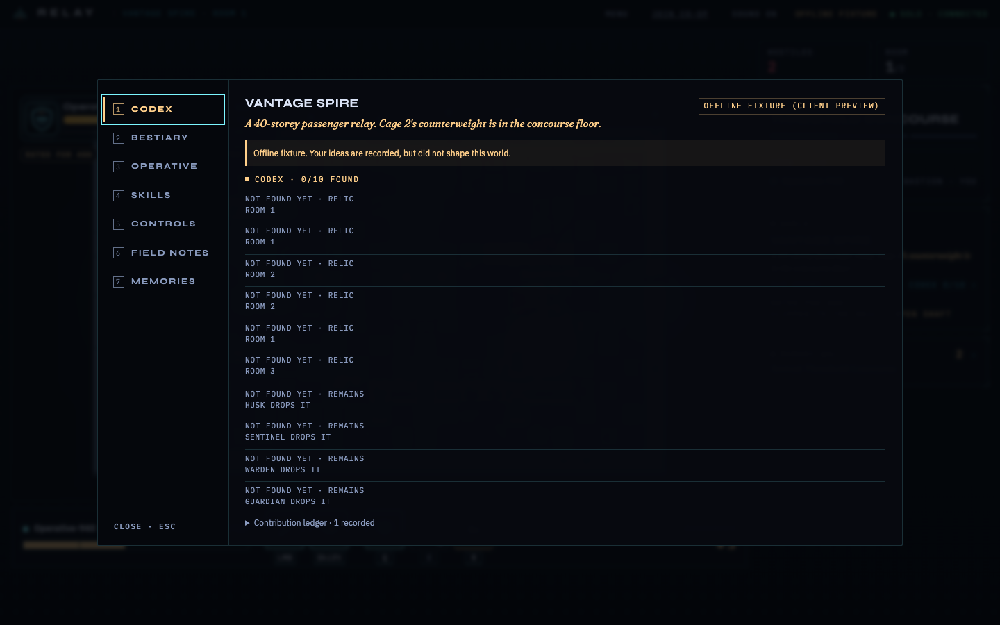

---

## What the AI actually does

```
crew's sentences ──▶ Claude (Messages API, forced recipe tool)
                         │  writes DATA: names, rooms, enemies, laws, lore, biome briefs
                         ▼
                     WorldRecipe JSON
                         │  Zod schema · closed registry IDs · prose lint · one bounded repair
                         ▼
                     trusted compiler (our code)
                         │  RoomSpec[] + ArtRecipe + CreationReceipt + provenance
                         ▼
                 validated again in the browser ──▶ Phaser renderer / pure simulation
```

- **Data, not code.** The model picks from a closed registry (`src/shared/registry.ts`): four
  classes, eight enemy ids, a fixed prop and tile vocabulary. An unknown id is a rejected
  recipe, not a new feature. No markup, no URLs, no expressions, nothing executable.
- **Rooms stream, and never change once committed.** The first room is committed and playable
  while later rooms are still arriving; a committed room is immutable.
- **Laws are the model's leverage on play.** A world can raise enemy counts, lower their health,
  make movement crawl during a basic attack, cut your vision — and the exact numbers are shown
  on screen and applied by the simulation, so a judge can read the rule and then feel it.
- **Bounded, honest fallback.** A live attempt is on a clock: 55 s per Claude call, 75 s for the
  whole world (`MAX_CALL_TIMEOUT_MS`, `DEFAULT_WORLD_BUDGET_MS`). If it runs out or fails,
  the request falls to the offline **composer**, which builds a world from the crew's words in
  milliseconds with no model call, or to a labelled fixture. Four provenance labels exist —
  `LIVE`, `COMPOSED`, `OFFLINE FIXTURE`, `FALLBACK FIXTURE (live attempt failed)` — and the one
  in the top bar and on the receipt is always the one that happened.
- **No model call is ever in the combat loop.** Generation happens between runs, on the server.

**Measured, not estimated.** On the hosted service, today: a live Claude world was ready to
enter **46.4 s** after the button, with zero console errors, and the badge read
`LIVE · claude-sonnet-4-6` (the screenshots in beats 3–5 above are that run). Across eight
live worlds during development: first room p50 **47 s**, max 50 s, about **$0.31** per world
(`docs/design/WORLDGEN_EVAL.md`).

### The honesty rules

They are product features, not modesty:

1. Fixture and composed content is **labelled as such**, everywhere it appears, forever.
2. A receipt attributes an idea to a feature only if the compiler really placed that feature.
   Unused ideas are shown as `recorded · not used in this world`.
3. Memories derive only from real `GameEvent`s. The game never invents a teammate, a rescue, a
   run or a past.
4. Docs separate **observed** from **unit-tested only** from **unverified** — see
   [`docs/QA.md`](docs/QA.md).

---

## How it's built

One TypeScript repo, one `package.json`, one Node process. Vite + React for the DOM shell,
Phaser 3.90 on the canvas, a **pure** simulation, `ws` for realtime, Zod at every trust
boundary, Vitest for tests.

```
browser                                            Node server (one process)
┌──────────────────────────────────────────┐      ┌───────────────────────────────────┐
│ React UI ── UiActions ──▶ GameController │      │ /api/health  /api/config          │
│   ▲ UiModel                  │           │ HTTP │ /api/world ─▶ GenerationService   │
│ Phaser renderer ◀ snapshots/events       │◀────▶│   live provider ▸ composer ▸      │
│   ▲                          │           │  WS  │   labelled fixture                │
│ GameSession (Local | Remote) ─┘          │      │ /ws authoritative co-op sim       │
│ pure sim (src/sim) / Chronicle reducer   │      │ dist/client static (production)   │
│ localStorage (memories)                  │      └───────────────────────────────────┘
└──────────────────────────────────────────┘
```

Boundaries that hold, and are tested:

- `src/sim` imports no Phaser, React, DOM, HTTP or timers. It is deterministic and runs in Node.
- The renderer draws snapshots and plays events; the UI sends actions. Neither mutates state.
- In co-op the **server is the authority**, including for feature flags: it answers
  `GET /api/config` and every client adopts that, so a crew cannot play one game while their
  screens draw another.
- Generated content is validated on the server *and* again in the browser.

| Path | What lives there |
| --- | --- |
| `src/shared/` | Zod contracts, closed registry, conventions, protocol, UI and render interfaces |
| `src/sim/` | Pure simulation: combat, abilities, rooms, boss phases, the collapse |
| `src/server/generation/`, `src/server/composer/` | Live providers, the safe compiler, the offline composer |
| `src/client/game/`, `src/client/transport/` | Controller, input, local and remote sessions |
| `src/client/render/`, `ui/`, `audio/` | Phaser renderer, React panels, procedural Web Audio |
| `src/chronicle/` | Pure event → memory reducer (memories cannot exist without events) |
| `fixtures/worlds/`, `prompts/runtime/` | Validated fixture worlds; the model's runtime instructions |
| `scripts/` | Headless screenshot and end-to-end harnesses (see below) |
| `docs/` | Product, architecture, art direction, QA, demo runbook, handoffs |

Deeper: [`docs/ARCHITECTURE.md`](docs/ARCHITECTURE.md) · [`docs/PRODUCT.md`](docs/PRODUCT.md) ·
[`docs/ART_DIRECTION.md`](docs/ART_DIRECTION.md) · [`docs/design/`](docs/design/).

---

## What is verified, and what isn't

`npm run check` = typecheck + **1107 Vitest tests across 92 files** + production build. Tests are
non-interactive and make no network or paid API calls; CI runs the same command on every push.

Three harnesses drive the real game with **real keyboard and mouse input only**. They read state
read-only from the DOM and from the `window.relay` handle the client already exposes: nothing is
injected, and there are no test hooks in the shipped app.

| Script | What it does |
| --- | --- |
| `scripts/shot.mjs` | Headless screenshots of any URL, plus an audit preset — [`docs/SCREENSHOTS.md`](docs/SCREENSHOTS.md) |
| `scripts/solo-e2e.mjs` | One browser plays solo: hub, biomes, the Custodian, the ritual, fixtures, onboarding, audio |
| `scripts/coop-e2e.mjs` | 2–5 browsers actually play co-op, and print a PASS/FAIL table — [`docs/QA_COOP.md`](docs/QA_COOP.md) |

**Observed in a browser** (every screenshot in this README came out of these runs, and every one
is a real run — none is a mock-up):

- A **live Claude world** on the hosted service, 46.4 s to playable, honest `LIVE` label, zero
  console errors; then its first room played.
- **Two browsers playing co-op** end to end on one authoritative server: host-only prepare,
  both screens in the same room, damage and deaths agreeing, an E unlock staying per-player, a
  downed player revived with hold F, three rooms, a shared debrief, and each device keeping its
  own memories. 18 of 19 checkpoints passed; the miss is a real if minor finding — the host's
  *Enter portal* button was not disabled while the gate read `1 / 2 READY`
  ([`docs/handoffs/FOLLOWUPS.md`](docs/handoffs/FOLLOWUPS.md)).
- **A run played to its end**: the boss through all three phases, the three-relay ritual, the
  Anchor planted, the debrief, and the hub afterwards with the run's memories on the wall.
- Floors: sealed doors, minimap and floor map, room kinds, the tier-4 Custodian named by the
  world, the collapse escape and the carry-one-relic choice ([`docs/QA_FULLRUN.md`](docs/QA_FULLRUN.md)).

**Not verified, and we will say so out loud:**

- A **physical two-laptop LAN demo** on venue Wi-Fi. Local multi-browser co-op does not prove a
  firewall.
- The **OpenAI/GPT** path beyond mocked provider tests.
- Whether the **floors ending is fair to a human** who walked the whole route. Bot runs die to
  the Custodian far more often than they beat it, and a bot that deep-links there arrives with
  none of the upgrades a real route pays for; that is a difficulty unknown, not a crash.

Box-by-box honesty, including a four-class × three-fixture survivability table:
[`docs/QA.md`](docs/QA.md).

---

## Configuration

Copy `.env.example` to `.env`. Every variable is read by the **server only**
(`src/server/config.ts`). Never commit `.env`; never put a key in a `VITE_` variable.

**Claude (what the hosted service runs):**

```dotenv
RELAY_GENERATION_MODE=live
RELAY_AI_PROVIDER=anthropic
ANTHROPIC_API_KEY=your-anthropic-api-key
ANTHROPIC_MODEL=claude-sonnet-4-6
```

**No key at all**, and still a world built from the crew's words — the offline composer picks a
theme from their sentences, echoes their words into the title, rooms and lore, and derives laws
and biome briefs in milliseconds. Labelled `COMPOSED · relay-composer`, never `live`:

```dotenv
RELAY_GENERATION_MODE=live
RELAY_AI_PROVIDER=composer
```

**GPT instead**, no code changes: `RELAY_AI_PROVIDER=openai` with `OPENAI_API_KEY` (model
defaults to `gpt-5-mini`). Both keys may stay configured; only the selected provider is called,
and the server never silently switches. Omitting `RELAY_GENERATION_MODE=live` keeps generation
offline. There is also an operator mode (`RELAY_AI_PROVIDER=operator`) that hands each request
to a watching coding agent through a folder — see [`docs/DEMO.md`](docs/DEMO.md).

### Flags

The **server decides for the whole crew** and reports its answer on `/api/config`; every client
adopts that, so a crew cannot play one game while their screens draw another. Both flags are off
in the bare source default and **on** everywhere we ship them: `.env.example`, the Dockerfile and
`render.yaml`. Set them to anything else (or delete them) for the three-room shape.

| Flag | Server env | Per-browser fallback | What it turns on |
| --- | --- | --- | --- |
| floors | `RELAY_FLOORS=1` | `?floors=1` | Five-biome routes (10/15/20/25/30 rooms) instead of three rooms |
| laws | `RELAY_LAWS=1` | `?laws=1` | Derived laws + look for worlds whose recipe has none (authored laws always apply) |

Other URL parameters: `?world=fixture` (bundled world, no server needed), `?room=<0-2>`,
`?autoenter=1`, `?mode=coop&as=<name>`, `?start=0` (skip the start screen), `?hints=off|reset`,
and renderer overrides `?palette= ?lighting= ?floor= ?wall= ?atmo= ?dark=`.

### Scripts

| Command | What it does |
| --- | --- |
| `npm run dev` | Server (tsx watch) + Vite client with `/api` and `/ws` proxied |
| `npm run dev:lan` | Same, bound to `0.0.0.0` so a second laptop can join |
| `npm run typecheck` | `tsc --noEmit` over client, server, shared, sim and tests |
| `npm test` | Vitest, non-interactive, no network |
| `npm run build` | Production client bundle to `dist/client` |
| `npm start` | One Node process serving `dist/client` + `/api` + `/ws` on `PORT` |
| `npm run check` | typecheck + test + build (what CI runs) |

### Co-op on a laptop, and in a container

```bash
npm run build && HOST=0.0.0.0 npm start     # teammates open http://<your-lan-ip>:8787/?mode=coop
docker build -t relay . && docker run --rm -p 8787:8787 relay
```

The image runs as a non-root user and serves client, API and WebSocket from one process;
`/api/health` is the healthcheck. One server holds one crew of up to four, so keep a single
instance; restarts reset the crew, while memories live in each browser. Deployment details,
including the Render blueprint (`render.yaml`, auto-deploy on `main`) and what to check after a
deploy, are in [`docs/DEMO.md`](docs/DEMO.md).

---

## Who built it

Three humans, three coding agents, one repo, GitHub as the source of truth. Ownership, hard
rules and the merge workflow are in **[`AGENTS.md`](AGENTS.md)** — read that first if you are
going to commit.

| Agent | Tool | Branch | Owns |
| --- | --- | --- | --- |
| A | Fable (Cursor) | `feat/core` | Contracts, simulation, controllers, networking, integration, deployment |
| B | Codex | `feat/generation` | Runtime AI generation and the safe compiler |
| C | Devin | `feat/presentation` | Rendering, audio, UI, the Chronicle, visual tokens |

Presenting it: [`docs/SUBMISSION.md`](docs/SUBMISSION.md) (the submission answers in full),
[`docs/PRESENTATION.md`](docs/PRESENTATION.md) (pitch, judge Q&A) and [`docs/DEMO.md`](docs/DEMO.md)
(runbook, fallback ladder). Per-agent handoffs with exact test results and known limitations:
[`docs/handoffs/`](docs/handoffs/).
